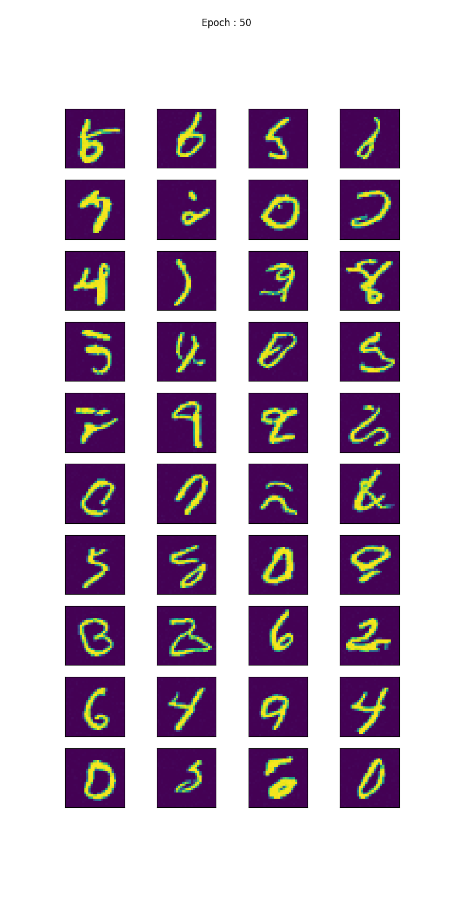
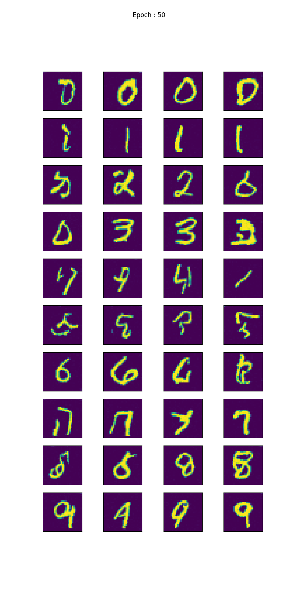

# Diffusion model 
Link to the paper : [Denoising Diffusion Probabilistic Models](https://arxiv.org/pdf/2006.11239.pdf)

For a brief tutorial refer to the DiffusionExample.ipynb file. I have used the MNIST dataset for training the model.

The underlying model that was used is quite simple, you might want to change the model by adding self-attention and so on. 

## Unconditional Model
The model does not take the label or is not conditioned on the label. The model has a flag called isConditional that represent if the model will be trained with conditional label
* train.py : The training file for training the model
* result_unconditional : Folder that shows the result of training  

## Conditional Model
The model is conditioned on the label of the image. Hence when generating you can control which class to sample the image from. 
* train_conditional.py : Training file for the conditional
* result_conditional : Folder that shows the result for conditional. You can notice in the samples.png, each row represent a sample from a particular class. 
